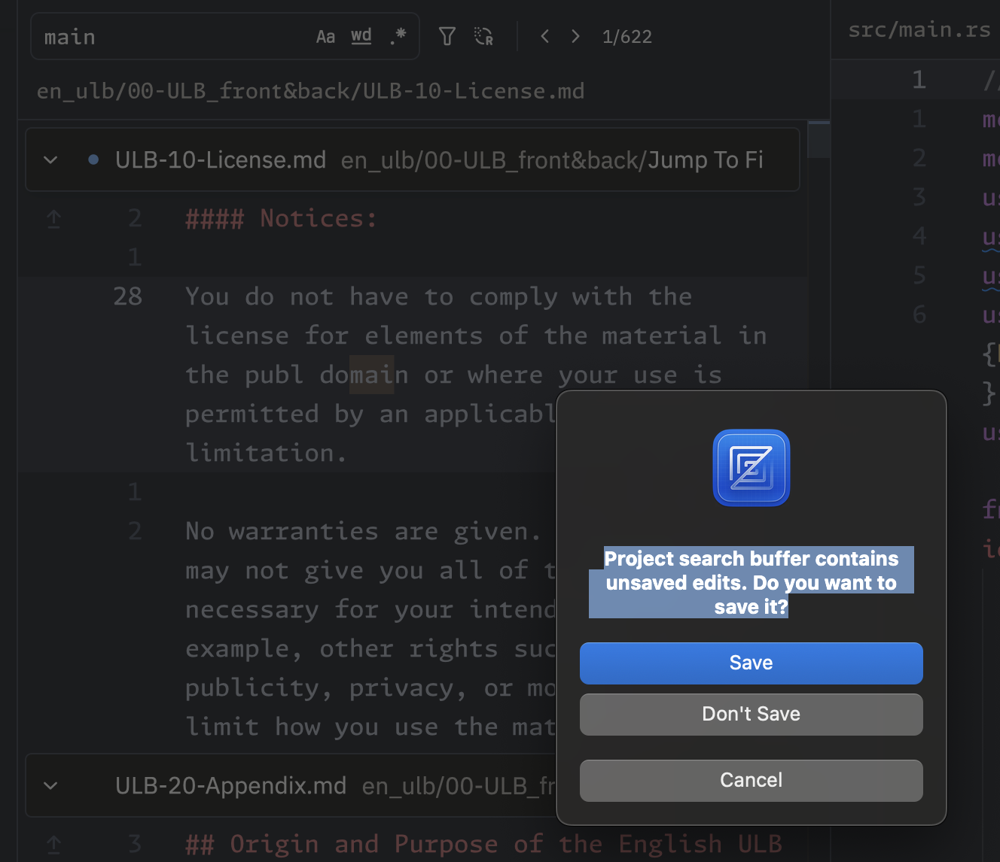

Using a fs:

1. hisetory -  
   1. Partial, couldn't get multiple histories acros chap/file working very well, so I just isolated to a single chapter and we rest on chapter change
2. Find replace still
   1. Have a vscode style find that allows for click ref to ref. Don't have a zed style multi buffer view, but that's arguably easier? Settings would go in popup or box near that. 
   2. Zed does -> , which prompts when you are going to exit that buffer. 
3. Mobile styles
4. Git commits on fs write
5. Actually fs write on save in us
6. a tour component?
7. Localizaiton pass will need doing
8. Tests
9.  Decorator for footnotes and nested editor for those?
    1.  
10. More ux / ui around any char markers, or don't worry about supporting?
11. Load other project as reference; (just shallow clone something else and pull in. Sync to current [proj][file] and [proj][file][chap] etc; )
12. 

Possible INTERFACES:
Editor
Parser
Project / FS
Git (though maybe just above?)

Clone (rust), libgit2.  Would prefer to just write to real files in fs and not idb and maybe not even opfs; 
--> List usfm files? (or just text files, and non usfm files just are raw lexical editor)? 
in memory:
{
  [fileName]: {
    [chapter]: {
      usfm: string //always latest from disk
      _dirtyLexical: 
      lexicalState(): // lazy return _dirtyState or calc intial
      dirty?: boolean // set to true when on lexical edit
    }
  }

lazy calc lexicalState on file open? 
optimistic mutation on file blur / edit, ie for filename[chapter], set _dirtyLexical; 

Search ->
every file to flat lexical state? 
group into sids: {[sid]: {plainText: string, lexicalNodes: [{guid: string, text: string}]}}

On editor update:
--guid in memory needs update to equal that node
--any guid on screen needs update to equal that node

switching projects should, commit? 

If we use react-query, we could call queryClient.setQueryData for key:projectId, which would be files in their dirty state: 
like setSTate, it's either a new val, or a unpdater fn of <T | undefined> => T | undefined, so it'd be like, given chapter idx, update chapter lexical state; It's immutable, so lot of copying, but prob not a big deal. 

const [currentView, setCurrentView] = useState({
  projectId: string,
  file: string,
  chapter: number,
})
const [mode, setMode] = useState<"wysi" | "raw">("wysi");

currentLexical = () => {
  return queryClient.getQueryData(key:currProjId)[currentView.file][currentView.chapter].lexicalState();
}
fn saveDirty(editorState:LexicalEditorState) {
  queryClient.setQueryData(key:currProjId, (old) => {
    old[currentView.file][currentView.chapter]._dirtyLexical = editorState;
    return old;
  });
}
fn projectFiles() {
  return Object.keys(queryClient.getQueryData(key:currProjId));
}
fn projectChapters() {
  return Object.keys(queryClient.getQueryData(key:currProjId)[currentView.file]);
}

changeChapter: -> (newChap:string) => setQueryData(key:currProjId, (old) => {
saveDirty(editorRef.current.getState());
setCurrentView({...currentView, chapter: newChap});
}); 
changeFile -> (newFile:string) => setQueryData(key:currProjId, (old) => {
saveDirty(editorRef.current.getState());
setCurrentView({...currentView, file: newFile});
}); 
changeProject -> (newProjId:string) => setQueryData(key:newProjId, (old) => {
saveDirty(editorRef.current.getState());
setCurrentView({...currentView, projectId: newProjId});
}); 

routes:
/ -> list projects, if no project, redirect to create
/projects/create
/projects/:projectId => tanstack query all usfm files for this project into memory if performant enough; Shape of {
  fileId: {
    chapterId: {
      usfm: string,
      _dirtyLexical: LexicalEditorState,
      lexicalState(): LexicalEditorState,
      dirty?: boolean
    }
  }
}
/settings ? font size and other stuff?

USFM: 
Will need fn to serialize from lexical state to usfm: 
Will need cleaner fn to go from parsedToken[] to lexical nodes json: 

Scaffold from git:
-- input takes url
-- pass that url to rust git clone, or could fetch a zip and pass u8[] to rust to write to fs.  Former probs better
-- After git clone, emit event to front end to say ok? Or auto load project. return project path, and optimistically mutate react query with project path?

 todos:
  history takes a 
  export type HistoryState = {
    current: null | HistoryStateEntry;
    redoStack: Array<HistoryStateEntry>;
    undoStack: Array<HistoryStateEntry>;
};

So we if kept history on a per file per chapter basis, we could keep undo/redo working on per each; For now it's all or nothing or rough; 

Todo:
make all ops against json shape
from json shape, for live editor instance moments, pass by keys and if an update is actually needed. Need to measure perf on getting json for each node though: 
Nested editors, get all of that type, and then pass those in as well: I,e, for each editor (main, and then nested), dispatch custom event?

for lexing:
maybe no id? 2 pass: Lint since we already have to touch every token. Flags for "in-markers' can apply to chars to, especially since they inline. 

Maybe change className to just be static string:

Overall we want message scoped to nodes / serialized objects: 
so on the obj we can just set lintErrors, (also keep a running list elsehwere for diplay) and then we can in serializeToken, pass those in, and then during keystroke lints, we just assumed all classNames returned from lint is correct; Deterministic alphabetic string, and if not equal just call set.  Perhaps in an ideal world we use css highlight instead of mutating the dom, but not supported in firefox atm. 

TOMORROW: 
fix linting bugs against kng nt
use linebreak plugin so we never use paras. Always one level flat: 
node selection jumps 2 when wysi preview on
allow enter key at the very edge of locked node?

insert X for top 8-10 markers that can call from type or from context menu action. Or basically the wysiwyg transforms based on expects num, expects space, is paired etc; 

Make nesteds work like top editor in terms of context menu and stuff?  (I think already work for modes being that we recursively updated, but the usfm plugin isnt' inserted in that composer, ie no wysi type.  )
upgrade markers back to markers after downgrading if the textNode matches marker + space
context menu
sync reference panels with main editor (i.e. scroll to sid)
reverse find (from source text)
tool tips
localization
more lint rules? 
push para markers forwards in sid instead of back?
Start writing tests for editor?
Start refining ui? 

Psalm \d marker and stuff should be included as part of a sid:0?  

today:
= Save (auto + review)

Flow: 
1. Store originalFileSidMap as ref: Won't change until we actually write to disk. 
2. Store currentSidUsfmMap as mut ref as well. Initial val = originalFileSidMap
3. Calc an intial stateful value of diffs to keep prepopulated (to known whether to block unload): 
4. When we mutate currentWorkingFiles in useActions (i.e save current dirty lexical) (contain all mutation to that ref in this one file), then we update the currentSidUsfmMapRef in only that file / chap:
5. We want the ability to then only recalc diffs for that file / chap and update the stateful diffs value: 
6. Clicking a "revert change" in the modal should then traverse the serialized workingFiles to do the update. If the update happened in the current file / chap, we also need to do an editor.update and set content as that serialized lexical state we just recomputed. Becuase we just adjusted the workingFiles there, we'd need to update that section of the currentSidUsfmMap and calc diffs again for that file / chap

\v1 one
\v2 two
\v3 three
\v4 four

\v1 one
[deleted]
[deleted]
\v4 four

and then:
\v1 one
\v2 two
\v3 three
\v4 four

\v1 one
[deleted]
[deleted]
\v4 four

_________
\v1 one
\v2 two

\v1 one and two merged in

Revert means:
- Take somethign from current working files and:
- IF 
  - was additions: (filter out all those nodes) in workingFiles
  - was removals: 
    - those nodes won't be in workingFiles. That sid wont' be in working files. But if we knew it's previous sibling node, we could push it in back in the right place, even if the sid itself is out of order (i.e. a 2, 34), that 34 still knows prev sibling was 2. 
  - was simply a change:
    - For each node in workingFiles of that sid, remove them from workingFiles, and insert old in their place
  

  sids:
  Before the first chapter marker, is intro material and should be
  GEN:0

  Once a chapter marker is there, but prior to first marker, should be:
  GEN:c# 0

  Once a verse if found, it should be
  GEN:c#v#

  Reading visually we can tell that the most logical grouping of sids is to read a subset of valid paragraphing marks forward I think. 

  Don't cross \c boundaries for para markers: 